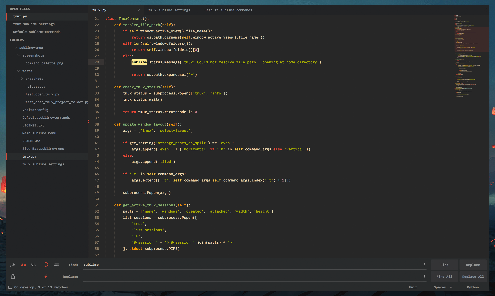

# Sublime Text configuration

Personal key mappings, packages, snippets and preferences for [Sublime Text 3](http://www.sublimetext.com/).

Typeface pictured: [Native](https://fortfoundry.com/products/native) by Fort Foundry. [Source Code Pro](https://fonts.google.com/specimen/Source+Code+Pro) is a close substitute.

**Theme**: [Boxy](https://packagecontrol.io/packages/Boxy%20Theme)  
**Colour scheme**: [gruvbox](https://github.com/morhetz/gruvbox)

#### Plugins

Plugin dependencies are listed in `Package Control.sublime-settings`. Most individual plugin settings are defined in corresponding `.sublime-settings` files.

#### Preferences

Core editor settings, including theme options, are defined in `Preferences.sublime-settings`. Some options are overridden by platform using [PlatformSettings](https://packagecontrol.io/packages/PlatformSettings).

Additional file type associations are set in separate `<syntax>.sublime-settings` files.

#### Key mappings

These are defined per-platform in each `Default (<platform>).sublime-keymap` file.

#### Build systems

Additional generic build systems are defined under `Builds/`.

## Installation

Place contents under your local Sublime Text `Packages/User/` directory and restart Sublime. Alternatively, sync settings from a local folder using [Package Syncing](https://packagecontrol.io/packages/Package%20Syncing), which is awesome for maintaining the same configuration over multiple devices.
